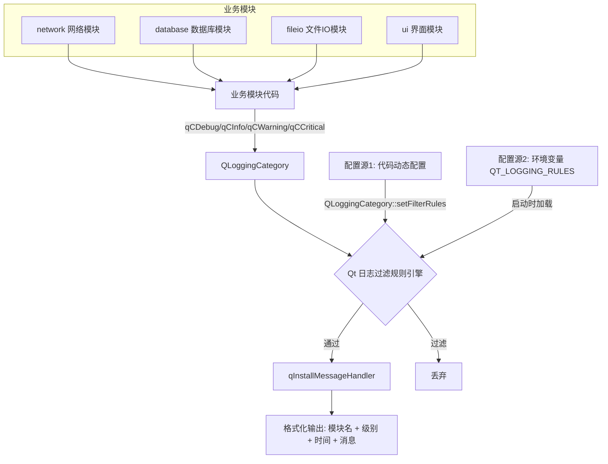

# Qt 模块级分级日志系统 - 设计文档

## 1. 系统架构



## 2. 核心设计思路

### 2.1 模块分类定义
- 每个业务模块通过 `Q_LOGGING_CATEGORY` 宏定义独立的日志分类
- 分类名采用 `app.模块名` 的命名规范（如 `app.network`、`app.database`）
- 所有分类在 `log_categories.h` 中集中声明，在对应 `.cpp` 中定义

### 2.2 过滤规则配置
- Qt 原生支持通过 `QLoggingCategory::setFilterRules()` 动态设置规则
- 规则格式：`分类名.级别=true/false`
- 支持通配符：`app.*.debug=false` 可批量关闭所有模块的 debug 日志

### 2.3 级别控制原理
Qt 日志级别从低到高：Debug < Info < Warning < Critical
- 设置某模块最低级别为 Warning 时，自动关闭 Debug 和 Info
- 通过 `LogHelper::setModuleLevel()` 封装级别控制逻辑
- 环境变量 `QT_LOGGING_RULES` 在程序启动前生效，优先级低于代码动态配置

### 2.4 日志格式化模块
- `LogFormatter`：独立封装的日志格式化输出模块（`log_formatter.h/cpp`）
- 提供 `install()/uninstall()/messageHandler()` 三个静态方法
- 输出格式：`[时间] [级别] [模块名] 消息内容`
- 内部使用 `QMutex` 保护 `fprintf` 输出，确保多线程安全
- 集成只需一行代码：`LogFormatter::install()`

### 2.5 辅助工具类
- `LogHelper`：提供便捷的模块级别设置、批量配置、模块启用/禁用等静态方法
- 使用 `QMap<QString, Level>` 维护模块级别映射，每次变更时重新生成完整规则（`rebuildAndApplyRules()`），避免规则无限堆积
- 所有公共方法通过 `QMutex` + `QMutexLocker` 保护，确保多线程安全
- 不做过度封装，保持与 Qt 原生 API 的一致性

## 3. 文件结构

```
qt-log-system/
├── CMakeLists.txt              # CMake 构建配置（主程序 + 测试目标）
├── Dockerfile                  # Docker 构建文件（多阶段，构建时自动跑测试）
├── Dockerfile.test             # 测试专用镜像
├── src/
│   ├── main.cpp                # 主函数 + 6个演示场景
│   ├── log_categories.h        # 日志分类声明（集中管理）
│   ├── log_categories.cpp      # 日志分类定义
│   ├── log_helper.h            # 日志辅助工具类（QMap + QMutex 线程安全）
│   ├── log_helper.cpp          # 日志辅助工具实现
│   ├── log_formatter.h         # 日志格式化输出模块（独立封装）
│   ├── log_formatter.cpp       # 日志格式化实现（线程安全输出）
│   ├── network_module.h        # 网络模块示例
│   ├── network_module.cpp
│   ├── database_module.h       # 数据库模块示例
│   ├── database_module.cpp
│   ├── fileio_module.h         # 文件IO模块示例
│   └── fileio_module.cpp
├── tests/
│   └── tst_log_helper.cpp      # QTest 单元测试（45 个用例）
├── docker-compose.yml
├── .gitignore
└── README.md
```

## 4. 配置方式对照

| 配置方式 | 生效时机 | 优先级 | 适用场景 |
|---------|---------|--------|---------|
| 代码动态配置 | 运行时随时 | 高 | 开发调试、运行时动态调整 |
| 环境变量配置 | 程序启动前 | 低 | 部署环境、CI/CD、无需改代码 |
